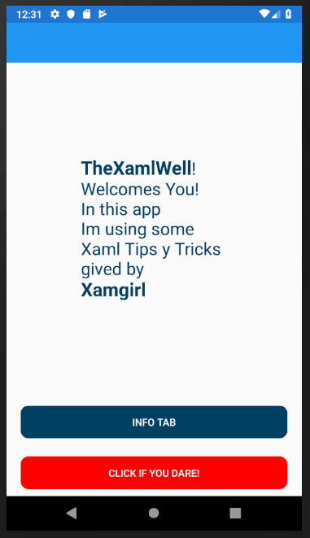

# XamlTipsTricks
Tips and tricks in xaml given by Xamgirl.

## Tips & Tricks used
In the app i used the following tips and tricks given by Xamgirl:
1. String format.
2. Static properties.
3. Atached properties.
4. Generic styles
5. Simplify NameSpaces
6. Line break.

